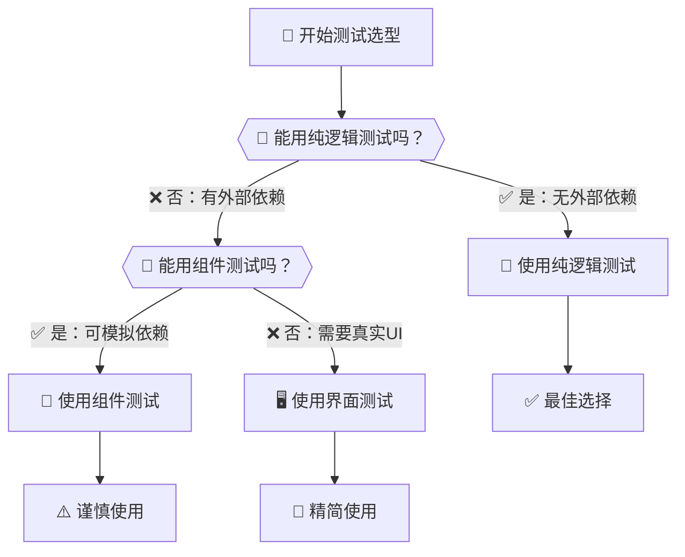

# Android单元测试标准化研究

## 📋 概述

本文档基于单元测试的实践，以**纯逻辑测试**、**组件测试**、**界面测试**三个依赖复杂度层级为分类标准，建立Android单元测试的标准化体系。每个层级都有其特定的测试框架、依赖库和最佳实践，形成完整的测试解决方案。

### 🎯 为什么选择依赖复杂度分类？

**传统问题**：很多团队按功能模块或技术栈分类测试，容易导致：
- 测试边界不清晰
- 框架选择混乱
- 维护成本高昂
- 执行效率低下

**研究方案**：按依赖复杂度递增分类，具有以下优势：

1. **清晰的测试边界** 📏
   - 纯逻辑：完全独立，无任何外部依赖
   - 组件：依赖Android框架或第三方服务
   - 界面：需要完整的运行环境

2. **递进的复杂度管理** 🔄
   - 从简单到复杂，逐层构建测试体系
   - 每层都有明确的职责范围
   - 避免过度工程和测试重复

3. **优化的执行效率** ⚡
   - 低层级测试执行更快，提供快速反馈
   - 高层级测试覆盖关键用户路径
   - 形成高效的测试金字塔结构

4. **明确的技术选型指导** 🧭
   - 每个层级都有适合的测试框架
   - 避免技术选择的困惑

---

## 🚀 一、纯逻辑测试 - 无外部依赖验证

### 🤔 什么时候使用纯逻辑测试？

**优先选择场景**：纯逻辑测试是测试体系的**基石**，应在以下情况下优先考虑：

✅ **业务规则验证** - 数据校验、计算逻辑、业务流程  
✅ **算法实现** - 数学计算、排序、搜索、格式化  
✅ **工具函数** - 字符串处理、日期转换、数据转换  
✅ **单一职责类** - 只包含逻辑处理，无外部调用  

**为什么是基石？**
- 🚀 **执行速度最快** - 毫秒级反馈，支持TDD开发
- 🎯 **错误定位精确** - 无外部干扰，问题定位更准确
- 🔄 **维护成本最低** - 无环境依赖，稳定性最好
- 📦 **覆盖效率最高** - 可以轻松实现高覆盖率

**避免使用的情况**：
❌ 依赖Android Context、Resources等框架API  
❌ 需要网络请求、数据库操作  
❌ 涉及文件I/O、线程操作  
❌ 复杂的对象交互和依赖注入  

### 1.1 测试目标与范围

纯逻辑测试专注于验证完全独立的业务逻辑，无任何外部依赖，包括：
- 数学计算逻辑
- 字符串处理算法
- 数据验证规则
- 业务规则验证
- 纯函数计算

### 1.2 核心依赖配置

```kotlin
// build.gradle.kts - 纯逻辑测试专用依赖
dependencies {
    // 现代化测试框架 - 丰富的注解和断言
    testImplementation("org.junit.jupiter:junit-jupiter:5.10.0")
    testImplementation("org.junit.jupiter:junit-jupiter-params:5.10.0")
    
    // 流式断言库 - 更清晰的断言表达
    testImplementation("com.google.truth:truth:1.1.5")
    
    // 匹配器库 - 灵活的断言匹配
    testImplementation("org.hamcrest:hamcrest:2.2")
    
    // Mock框架 - 用于复杂对象模拟（可选）
    testImplementation("org.mockito:mockito-core:5.5.0")
}
```

### 1.3 JUnit 5 + Truth - 基础逻辑测试

**适用场景**：无外部依赖的纯业务逻辑、算法、数据验证

```java
class CalculatorTest {
    
    private Calculator calculator;
    
    @BeforeEach
    void setUp() {
        calculator = new Calculator();
    }
    
    @Test
    @DisplayName("基本数学运算 - 加法计算")
    void add_normalNumbers_shouldReturnCorrectSum() {
        // 测试基本加法
        int result = calculator.add(5, 3);
        
        // 使用Truth进行流式断言
        assertThat(result).isEqualTo(8);
    }
    
    @Test
    @DisplayName("边界条件 - 零值计算")
    void add_withZero_shouldHandleCorrectly() {
        assertThat(calculator.add(0, 5)).isEqualTo(5);
        assertThat(calculator.add(5, 0)).isEqualTo(5);
        assertThat(calculator.add(0, 0)).isEqualTo(0);
    }
    
    @Test
    @DisplayName("负数计算")
    void add_negativeNumbers_shouldCalculateCorrectly() {
        assertThat(calculator.add(-5, 3)).isEqualTo(-2);
        assertThat(calculator.add(-5, -3)).isEqualTo(-8);
        assertThat(calculator.add(5, -3)).isEqualTo(2);
    }
    
    @ParameterizedTest(name = "除法 {0} ÷ {1} = {2}")
    @CsvSource({
        "10, 2, 5.0",
        "15, 3, 5.0", 
        "7, 2, 3.5",
        "-10, 2, -5.0"
    })
    void divide_variousInputs_shouldReturnExpected(int dividend, int divisor, double expected) {
        double result = calculator.divide(dividend, divisor);
        assertThat(result).isWithin(0.001).of(expected);
    }
    
    @Test
    @DisplayName("除零异常测试")
    void divide_byZero_shouldThrowException() {
        ArithmeticException exception = assertThrows(
            ArithmeticException.class, 
            () -> calculator.divide(10, 0)
        );
        assertThat(exception.getMessage()).contains("除数不能为零");
    }
}
```

### 1.4 字符串验证逻辑测试

**适用场景**：数据格式验证、字符串处理逻辑

```java
class UserValidatorTest {
    
    private UserValidator validator;
    
    @BeforeEach
    void setUp() {
        validator = new UserValidator();
    }
    
    @ParameterizedTest(name = "邮箱 {0} 验证应该返回 {1}")
    @CsvSource({
        "valid@example.com, true",
        "user.name@company.org, true",
        "test123@gmail.com, true",
        "invalid.email, false",
        "@example.com, false",
        "user@, false",
        "'', false",
        "null, false"
    })
    void validateEmail_variousFormats_shouldReturnExpected(String email, boolean expected) {
        boolean result = validator.isValidEmail(email);
        assertThat(result).isEqualTo(expected);
    }
    
    @Test
    @DisplayName("密码强度验证 - 有效密码")
    void validatePassword_strongPassword_shouldPass() {
        String strongPassword = "SecurePass123!";
        
        PasswordStrength strength = validator.checkPasswordStrength(strongPassword);
        
        assertThat(strength.isValid()).isTrue();
        assertThat(strength.getScore()).isAtLeast(8);
        assertThat(strength.getMissingRequirements()).isEmpty();
    }
    
    @Test
    @DisplayName("密码强度验证 - 弱密码")
    void validatePassword_weakPassword_shouldFail() {
        String weakPassword = "123";
        
        PasswordStrength strength = validator.checkPasswordStrength(weakPassword);
        
        assertThat(strength.isValid()).isFalse();
        assertThat(strength.getScore()).isLessThan(5);
        assertThat(strength.getMissingRequirements()).containsAtLeast(
            "至少8个字符", "包含大写字母", "包含小写字母", "包含特殊字符"
        );
    }
}
```

### 1.5 纯逻辑测试最佳实践

**测试策略**：
- 快速执行：每个测试应在毫秒级完成
- 无副作用：测试间完全独立，无状态共享
- 边界覆盖：null值、空值、极值、异常情况
- 可读性强：测试即文档，清晰表达业务意图

**设计原则**：
- 单一职责：每个测试只验证一个逻辑点
- 确定性：相同输入必须产生相同输出
- 自包含：测试数据在测试内部构造
- 快速反馈：失败时能立即定位问题根因

---

## 🔧 二、组件测试 - 有Android/网络依赖验证

### 🤔 什么时候使用组件测试？

**核心判断标准**：当你的代码**依赖外部系统**但仍然需要**快速反馈**时，选择组件测试。

**优先选择场景**：

🎯 **Android框架依赖**
✅ 使用Context获取系统服务  
✅ 访问SharedPreferences、数据库  
✅ 读取应用资源(strings.xml, assets)  
✅ 文件系统操作(内部存储)  

🌐 **网络服务依赖**
✅ HTTP API调用和响应处理  
✅ 网络状态检测和重试机制  
✅ 数据缓存和同步逻辑  
✅ 文件上传下载功能  

🔌 **复杂业务逻辑**
✅ 有多个外部依赖的服务类  
✅ 需要模拟外部系统行为  
✅ 异步操作和事件处理  
✅ 状态管理和数据流转  

**技术选型指导**：
- 🤖 **Robolectric** - Android环境模拟，在JVM中运行
- 🔌 **MockWebServer** - HTTP服务模拟，可控的网络环境
- 🎭 **Mockito** - 对象模拟，复杂依赖管理

**为什么不直接用界面测试？**
- 界面测试运行慢，反馈周期长
- 组件测试可以保持快速执行(1-3秒)
- 更容易定位问题根因
- 支持更精细的边界条件测试

### 2.1 测试目标与范围

组件测试专注于验证依赖外部系统的组件，占比30%，包括：
- Android组件相关功能（Context、资源、文件系统）
- 网络请求与API调用
- 数据存储和缓存
- 复杂业务逻辑（有外部依赖）
- 第三方库集成测试

### 2.2 核心依赖配置

```kotlin
// build.gradle.kts - 组件测试专用依赖
dependencies {
    // Android组件测试框架 - 在JVM中模拟Android环境
    testImplementation("org.robolectric:robolectric:4.15")
    testImplementation("androidx.test:core:1.5.0")
    testImplementation("androidx.test.ext:junit:1.1.5")
    
    // 网络集成测试框架 - HTTP服务模拟
    testImplementation("com.squareup.okhttp3:mockwebserver:4.12.0")
    
    // Mock框架 - 依赖隔离和行为验证
    testImplementation("org.mockito:mockito-core:5.5.0")
    testImplementation("org.mockito:mockito-junit-jupiter:5.5.0")
    
    // 基础测试框架
    testImplementation("org.junit.jupiter:junit-jupiter:5.10.0")
    testImplementation("com.google.truth:truth:1.1.5")
    testImplementation("org.hamcrest:hamcrest:2.2")
    
    // 架构组件测试支持
    testImplementation("androidx.arch.core:core-testing:2.2.0")
}

// 关键配置 - 支持Android资源访问
android {
    testOptions {
        unitTests {
            isIncludeAndroidResources = true
        }
    }
}
```

### 2.3 Robolectric - Android组件测试

**适用场景**：测试依赖Android Context、文件系统、资源访问的组件

```java
@RunWith(AndroidJUnit4.class)
@Config(sdk = {29})
public class FileUtilTest {
    
    private Context context;
    private FileUtil fileUtil;
    
    @Before
    public void setUp() {
        context = ApplicationProvider.getApplicationContext();
        fileUtil = new FileUtil(context);
    }
    
    @Test
    public void writeToInternalStorage_validData_shouldSuccess() {
        // 测试文件写入功能
        String filename = "test_config.json";
        String content = "{\"version\":\"1.0\",\"debug\":true}";
        
        boolean result = fileUtil.writeToInternalStorage(filename, content);
        
        assertTrue("文件写入应该成功", result);
        assertTrue("文件应该存在", fileUtil.fileExists(filename));
        assertEquals("内容应该匹配", content, 
            fileUtil.readFromInternalStorage(filename));
    }
    
    @Test
    public void getFileSize_nonExistentFile_shouldReturnMinusOne() {
        // 测试边界条件
        long size = fileUtil.getFileSize("non_existent.txt");
        assertEquals("不存在文件应该返回-1", -1, size);
    }
    
    @Test
    public void getApplicationInfo_shouldReturnValidInfo() {
        // 测试Android资源访问
        AppInfo info = fileUtil.getApplicationInfo();
        
        assertThat(info.getPackageName()).isEqualTo("com.oneblue3.unicasetest");
        assertThat(info.getVersionName()).isNotEmpty();
        assertThat(info.getTargetSdk()).isAtLeast(29);
    }
}
```

### 2.4 MockWebServer - 网络组件测试

**适用场景**：测试HTTP客户端、API调用封装、网络状态处理

```java
class NetworkUtilTest {
    
    private MockWebServer mockServer;
    private NetworkUtil networkUtil;
    
    @BeforeEach
    void setUp() throws IOException {
        mockServer = new MockWebServer();
        mockServer.start();
        networkUtil = new NetworkUtil(mockServer.url("/").toString());
    }
    
    @AfterEach
    void tearDown() throws IOException {
        mockServer.shutdown();
    }
    
    @Test
    void fetchUserData_successResponse_shouldParseCorrectly() {
        // 模拟成功响应
        mockServer.enqueue(new MockResponse()
            .setResponseCode(200)
            .setHeader("Content-Type", "application/json")
            .setBody("{\"id\":1,\"name\":\"张三\",\"status\":\"active\"}"));
        
        UserData result = networkUtil.fetchUserData(1);
        
        assertThat(result.getId()).isEqualTo(1);
        assertThat(result.getName()).isEqualTo("张三");
        assertThat(result.getStatus()).isEqualTo("active");
        
        // 验证请求参数
        RecordedRequest request = mockServer.takeRequest();
        assertThat(request.getPath()).isEqualTo("/users/1");
        assertThat(request.getMethod()).isEqualTo("GET");
    }
    
    @Test
    void fetchUserData_networkTimeout_shouldThrowException() {
        // 模拟网络超时
        mockServer.enqueue(new MockResponse()
            .setSocketPolicy(SocketPolicy.NO_RESPONSE));
        
        assertThrows(NetworkTimeoutException.class, 
            () -> networkUtil.fetchUserData(1));
    }
    
    @Test
    void uploadFile_withProgress_shouldTrackCorrectly() {
        // 模拟文件上传进度
        mockServer.enqueue(new MockResponse()
            .setResponseCode(200)
            .setBody("{\"status\":\"success\",\"fileId\":\"FILE_123\"}"));
        
        ProgressTracker tracker = new ProgressTracker();
        UploadResult result = networkUtil.uploadFile(
            new File("test.jpg"), tracker);
        
        assertThat(result.isSuccess()).isTrue();
        assertThat(result.getFileId()).isEqualTo("FILE_123");
        assertThat(tracker.getProgress()).isEqualTo(100);
    }
}
```

### 2.5 Mockito - 复杂业务逻辑测试

**适用场景**：有外部依赖的业务逻辑、服务层组件、复杂交互场景

```java
@ExtendWith(MockitoExtension.class)
class OrderServiceTest {
    
    @Mock private PaymentService paymentService;
    @Mock private InventoryService inventoryService;
    @Mock private NotificationService notificationService;
    @Mock private AuditLogger auditLogger;
    
    @InjectMocks private OrderService orderService;
    
    @Test
    void processOrder_normalFlow_shouldCompleteSuccessfully() {
        // 准备测试数据
        Order order = OrderTestDataBuilder.create()
            .withProductId("PHONE_001")
            .withQuantity(2)
            .withCustomerId("CUST_123")
            .withAmount(new BigDecimal("1999.98"))
            .build();
        
        // 配置Mock行为 - 库存充足
        when(inventoryService.checkAvailability("PHONE_001", 2))
            .thenReturn(InventoryStatus.AVAILABLE);
        when(inventoryService.reserveItems("PHONE_001", 2))
            .thenReturn(ReservationResult.success("RES_456"));
        
        // 配置Mock行为 - 支付成功
        when(paymentService.processPayment(any(PaymentRequest.class)))
            .thenReturn(PaymentResult.success("PAY_789"));
        
        // 执行业务逻辑
        OrderResult result = orderService.processOrder(order);
        
        // 验证结果
        assertThat(result.isSuccess()).isTrue();
        assertThat(result.getOrderId()).isNotNull();
        assertThat(result.getStatus()).isEqualTo(OrderStatus.COMPLETED);
        assertThat(result.getPaymentId()).isEqualTo("PAY_789");
        
        // 验证交互行为
        verify(inventoryService).checkAvailability("PHONE_001", 2);
        verify(inventoryService).reserveItems("PHONE_001", 2);
        verify(paymentService).processPayment(argThat(payment -> 
            payment.getAmount().equals(new BigDecimal("1999.98")) &&
            payment.getCustomerId().equals("CUST_123")));
        verify(notificationService).sendOrderConfirmation("CUST_123", result.getOrderId());
        verify(auditLogger).logOrderProcessed(order, result);
    }
    
    @Test
    void processOrder_insufficientInventory_shouldCancelOrder() {
        Order order = OrderTestDataBuilder.create()
            .withProductId("PHONE_001")
            .withQuantity(100) // 超出库存
            .build();
        
        when(inventoryService.checkAvailability("PHONE_001", 100))
            .thenReturn(InventoryStatus.INSUFFICIENT);
        
        OrderResult result = orderService.processOrder(order);
        
        assertThat(result.isSuccess()).isFalse();
        assertThat(result.getStatus()).isEqualTo(OrderStatus.CANCELLED);
        assertThat(result.getErrorCode()).isEqualTo("INSUFFICIENT_INVENTORY");
        
        // 验证不应该执行的操作
        verify(paymentService, never()).processPayment(any());
        verify(notificationService, never()).sendOrderConfirmation(any(), any());
        
        // 验证错误日志
        verify(auditLogger).logOrderCancelled(order, "库存不足");
    }
}

---

## 🖥️ 三、界面测试 - 完整用户交互验证

### 🤔 什么时候使用界面测试？

**核心判断标准**：当你需要验证**完整的用户操作流程**和**端到端场景**时，才使用界面测试。

**关键原则：少而精**
🎯 **只测试最重要的用户路径** - 不要试图覆盖所有UI交互  
🔍 **关注业务价值链路** - 从用户输入到最终结果的完整流程  
⚡ **避免细节测试** - 不测试单个按钮或字段验证  

**优先选择场景**：

📝 **关键业务流程**
✅ 用户注册登录完整流程  
✅ 购买付款端到端场景  
✅ 数据提交后的页面反馈  
✅ 多步骤导向类操作  

🔄 **跨页面交互**
✅ 下一步/上一步导航流程  
✅ Tab切换和数据保持  
✅ 外部应用调用(相机、地图)  
✅ 深度链接和意图处理  

🚫 **不适合界面测试的情况**：
❌ 单个按钮点击效果  
❌ 单一字段验证规则  
❌ 复杂的数据计算逻辑  
❌ 网络异常处理逻辑  

**为什么不能过度使用？**
- 🕒 **执行时间长** - 单个测试可能需要10-30秒
- 🐛 **调试困难** - 失败时难以定位具体问题
- 💰 **维护成本高** - UI改动容易导致测试失败
- 🌍 **环境依赖强** - 需要真实设备或模拟器

**成功的界面测试策略**：
✨ **10%的数量，90%的价值** - 精选最关键的用户场景  
🎯 **业务驱动** - 基于用户故事设计测试用例  
🔄 **稳定第一** - 优先保证现有测试的稳定性  

### 3.1 测试目标与范围

界面测试验证完整的用户交互流程，占比10%，关注：
- 端到端用户场景测试
- 多页面导航流程
- 表单输入验证
- 用户操作响应
- 界面状态变化
- 跨应用交互

### 3.2 核心依赖配置

```kotlin
// build.gradle.kts - 界面测试专用依赖
dependencies {
    // Android UI测试核心框架
    androidTestImplementation("androidx.test.ext:junit:1.1.5")
    androidTestImplementation("androidx.test:runner:1.5.2")
    androidTestImplementation("androidx.test:rules:1.5.0")
    
    // Espresso UI自动化测试套件 - 专注应用内界面交互
    androidTestImplementation("androidx.test.espresso:espresso-core:3.5.1")
    androidTestImplementation("androidx.test.espresso:espresso-intents:3.5.1")
    androidTestImplementation("androidx.test.espresso:espresso-contrib:3.5.1")
    
    // 断言库支持
    androidTestImplementation("org.hamcrest:hamcrest:2.2")
    androidTestImplementation("com.google.truth:truth:1.1.5")
}

// UI测试配置优化
android {
    testOptions {
        animationsDisabled = true // 禁用动画提高测试稳定性
    }
}
```

### 3.3 Espresso - 界面交互测试

**适用场景**：应用内UI组件交互、表单操作、页面导航

```java
@RunWith(AndroidJUnit4.class)
@LargeTest
public class MainActivityUITest {
    
    @Rule
    public ActivityScenarioRule<MainActivity> activityRule = 
        new ActivityScenarioRule<>(MainActivity.class);
    
    @Test
    public void navigationTabs_clickDifferentTabs_shouldSwitchCorrectly() {
        // 验证初始状态
        onView(withId(R.id.btn_user_registration))
            .check(matches(isDisplayed()))
            .check(matches(isSelected()));
        
        // 切换到计算器页面
        onView(withId(R.id.btn_calculator))
            .perform(click());
        
        // 验证状态变化
        onView(withId(R.id.btn_calculator))
            .check(matches(isSelected()));
        onView(withId(R.id.btn_user_registration))
            .check(matches(not(isSelected())));
        
        // 切换到数据列表页面
        onView(withId(R.id.btn_data_list))
            .perform(click());
        
        onView(withId(R.id.btn_data_list))
            .check(matches(isSelected()));
    }
    
    @Test
    public void userRegistration_completeForm_shouldShowSuccess() {
        // 进入用户注册页面
        onView(withId(R.id.btn_user_registration))
            .perform(click());
        
        // 填写注册表单
        onView(withId(R.id.edit_username))
            .perform(typeText("testuser2024"), closeSoftKeyboard());
        
        onView(withId(R.id.edit_email))
            .perform(typeText("testuser@example.com"), closeSoftKeyboard());
        
        onView(withId(R.id.edit_password))
            .perform(typeText("SecurePass123!"), closeSoftKeyboard());
        
        onView(withId(R.id.edit_confirm_password))
            .perform(typeText("SecurePass123!"), closeSoftKeyboard());
        
        // 提交表单
        onView(withId(R.id.btn_submit_registration))
            .perform(click());
        
        // 验证成功提示
        onView(withText("注册成功"))
            .check(matches(isDisplayed()));
        
        // 或验证Toast消息
        onView(withText("用户注册成功，请查收邮件激活账户"))
            .inRoot(withDecorView(not(is(decorView))))
            .check(matches(isDisplayed()));
    }
    
    @Test
    public void formValidation_emptyFields_shouldShowErrors() {
        onView(withId(R.id.btn_user_registration))
            .perform(click());
        
        // 直接点击提交，不填写任何内容
        onView(withId(R.id.btn_submit_registration))
            .perform(click());
        
        // 验证错误提示
        onView(withId(R.id.edit_username))
            .check(matches(hasErrorText("用户名不能为空")));
        
        onView(withId(R.id.edit_email))
            .check(matches(hasErrorText("邮箱地址不能为空")));
        
        onView(withId(R.id.edit_password))
            .check(matches(hasErrorText("密码不能为空")));
    }
}
```

### 3.4 Espresso-Intents - Intent交互测试

**适用场景**：Activity间跳转、外部应用调用、Intent数据传递

```java
@RunWith(AndroidJUnit4.class)
public class IntentInteractionTest {
    
    @Rule
    public ActivityScenarioRule<MainActivity> activityRule = 
        new ActivityScenarioRule<>(MainActivity.class);
    
    @Before
    public void setUp() {
        Intents.init();
    }
    
    @After
    public void tearDown() {
        Intents.release();
    }
    
    @Test
    public void shareButton_click_shouldLaunchShareIntent() {
        // 模拟分享操作
        onView(withId(R.id.btn_share_result))
            .perform(click());
        
        // 验证Intent被发送
        intended(allOf(
            hasAction(Intent.ACTION_SEND),
            hasType("text/plain"),
            hasExtra(Intent.EXTRA_TEXT, containsString("计算结果"))
        ));
    }
    
    @Test
    public void settingsMenu_click_shouldOpenSettings() {
        onView(withId(R.id.menu_settings))
            .perform(click());
        
        // 验证设置页面Intent
        intended(hasComponent(SettingsActivity.class.getName()));
    }
}
```

### 3.6 界面测试最佳实践

**测试策略**：
- 关键路径优先：核心用户流程必须覆盖
- 稳定性设计：避免依赖具体坐标或时间
- 数据隔离：每个测试使用独立的测试数据
- 失败恢复：测试失败时能够快速定位问题

**框架选择指南**：
- Espresso：应用内UI交互（推荐）
- Espresso-Intents：Intent和Activity跳转
- 专注核心流程：避免测试过多细节交互
- 端到端场景：验证完整的用户操作路径

---

## 📊 三个依赖层级测试对比总结

### 🧭 如何选择正确的测试类型？

遵循**从下到上**的决策流程：



### 📈 决策矩阵：不同场景的最佳选择

| 场景类型 | 纯逻辑测试 | 组件测试 | 界面测试 | 推荐方案 |
|----------|----------|---------|---------|----------|
| 数学计算 | ✅ **完美** | ❌ 过度 | ❌ 过度 | 🚀 **纯逻辑** |
| 字符串处理 | ✅ **完美** | ❌ 过度 | ❌ 过度 | 🚀 **纯逻辑** |
| 数据验证 | ✅ **完美** | ❌ 过度 | ❌ 过度 | 🚀 **纯逻辑** |
| 文件操作 | ❌ 需依赖 | ✅ **完美** | ❌ 过度 | 🔧 **组件** |
| 网络请求 | ❌ 需依赖 | ✅ **完美** | ❌ 过度 | 🔧 **组件** |
| 数据存储 | ❌ 需依赖 | ✅ **完美** | ❌ 过度 | 🔧 **组件** |
| 单个UI组件 | ❌ 无意义 | ❌ 过度 | ✅ **合适** | 🖥️ **界面**(谨慎) |
| 端到端流程 | ❌ 无意义 | ❌ 无意义 | ✅ **完美** | 🖥️ **界面** |
| 用户业务流 | ❌ 无意义 | ❌ 无意义 | ✅ **完美** | 🖥️ **界面** |

### 测试分布与特点

| 依赖层级 | 占比 | 执行环境 | 主要框架 | 执行速度 | 覆盖范围 |
|---------|------|----------|----------|----------|----------|
| **纯逻辑测试** | 60% | JVM | JUnit 5 + Truth | 极快 | 业务核心 |
| **组件测试** | 30% | JVM | Robolectric + MockWebServer + Mockito | 快速 | 外部依赖 |
| **界面测试** | 10% | 设备/模拟器 | Espresso + UIAutomator | 较慢 | 用户体验 |

### 📦 依赖库职责分工

**纯逻辑测试工具箱** (testImplementation)：
- 🚀 **JUnit 5** - 现代化测试框架，提供丰富注解和生命周期管理
- ✨ **Truth** - Google出品流式断言库，让测试更易读
- 🎯 **Hamcrest** - 经典匹配器库，提供灵活的断言匹配

**组件测试工具箱** (testImplementation)：
- 🤖 **Robolectric** - Android环境模拟，让Android组件在JVM中运行
- 🌐 **MockWebServer** - HTTP服务模拟，OkHttp团队出品
- 🎭 **Mockito** - 对象Mock框架，处理复杂依赖隔离和行为验证
- 🕰️ **ArchCore Testing** - Android架构组件测试支持

**界面测试工具箱** (androidTestImplementation)：
- ☕ **Espresso** - Google官方UI自动化测试框架，专注应用内交互
- 📋 **Test Rules** - 测试规则和生命周期管理，控制测试环境
- 🔗 **Espresso-Intents** - Intent交互测试，处理Activity跳转
